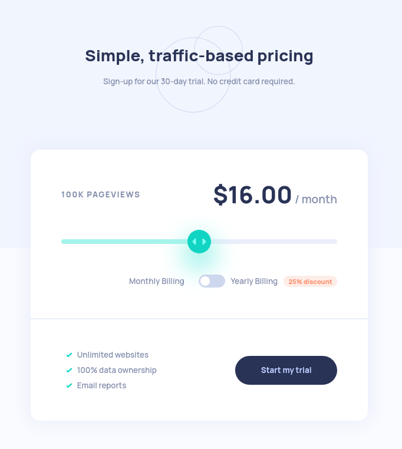
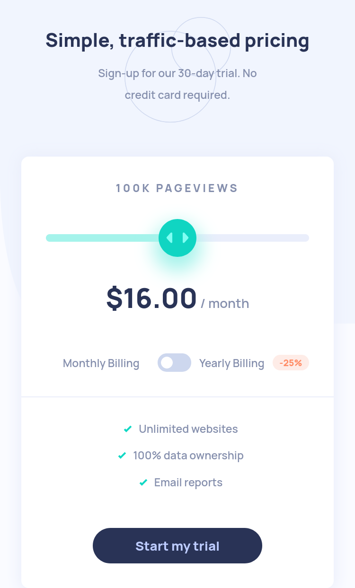

# Frontend Mentor - Interactive pricing component solution

This is a solution to the [Interactive pricing component challenge on Frontend Mentor](https://www.frontendmentor.io/challenges/interactive-pricing-component-t0m8PIyY8). Frontend Mentor challenges help you improve your coding skills by building realistic projects.

## Table of contents

- [Overview](#overview)
  - [The challenge](#the-challenge)
  - [Screenshot](#screenshot)
  - [Links](#links)
- [My process](#my-process)
  - [Built with](#built-with)
  - [What I learned](#what-i-learned)
  - [Useful resources](#useful-resources)
- [Author](#author)

## Overview

### The challenge

Users should be able to:

- View the optimal layout for the app depending on their device's screen size
- See hover states for all interactive elements on the page
- Use the slider and toggle to see prices for different page view numbers

### Screenshot

### Links

- Solution URL: [Frontend Mentor Solution URL](https://www.frontendmentor.io/solutions/responsive-interactive-pricing-using-flexbox-and-react-pgfDcq1jo7)
- Live Site URL: [Github Pages URL](https://loganf50.github.io/interactive-pricing/)

## My process

### Built with

- Semantic HTML5 markup
- CSS custom properties
- Flexbox
- Mobile-first workflow
- [React](https://reactjs.org/) - JS library
- Vite

### What I learned

- React: some basic components along with some simple useState
- how to style an input:range. It is a lot more css than I was expecting

### Useful resources

- [Vite to Github Pages](https://dev.to/shashannkbawa/deploying-vite-app-to-github-pages-3ane) - This helped deploy the live site
- [React Slider Component](https://upmostly.com/tutorials/build-a-react-switch-toggle-component) - my slider was mostly copied from here

## Author

- Frontend Mentor - [@LoganF50](https://www.frontendmentor.io/profile/LoganF50)
